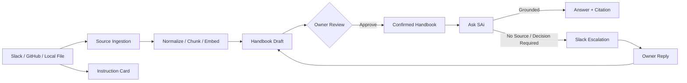

# SAi Backend

SAi의 인증, 사내 지식 수집, 핸드북 구축, RAG 기반 질의응답, 지시 카드 생성, Slack 에스컬레이션을 담당하는 Django REST API 서버입니다.

## Tech Stack

| Category        | Technology                                  |
| --------------- | ------------------------------------------- |
| Backend         | Python 3.12+, Django, Django REST Framework |
| Auth            | SimpleJWT                                   |
| Database        | PostgreSQL 16                               |
| Vector Search   | pgvector, HNSW, Cosine Distance             |
| AI              | OpenAI API                                  |
| Embedding       | `text-embedding-3-small`                    |
| Integration     | Slack, GitHub, Local File                   |
| Storage         | AWS S3                                      |
| Server          | Gunicorn                                    |
| Package Manager | Poetry                                      |
| Deployment      | GitHub Actions, AWS EC2                     |

---

## Architecture



백엔드의 핵심 흐름은 다음과 같습니다.

1. 외부 협업 데이터를 수집해 사내 지식으로 변환
2. 승인된 Handbook을 기반으로 Ask SAi 답변 생성
3. 근거가 없거나 새로운 결정이 필요한 질문은 Owner에게 에스컬레이션
4. Owner의 답변을 새로운 Handbook 규칙 후보로 축적
5. Slack 업무 지시를 구조화된 Instruction Card로 변환

---

## Project Structure

```text
sai/
├── config/       # Django 설정
├── accounts/     # 인증, 사용자, OWNER/MEMBER
├── companies/    # 회사 및 구성원
├── onboarding/   # 초기 조직 규칙 구축
├── sources/      # 데이터 수집, Chunk, Embedding, Worker
├── handbook/     # 사내 규칙, Scope, Evidence, Vector Retrieval
├── cards/        # Instruction Card, Step, Blank
├── qna/          # Ask SAi, Citation, Escalation
└── policy/       # 위험 키워드
```

---

## Core Flow

### 1. Source Ingestion

Slack, GitHub, Local File에서 데이터를 수집해 검색 가능한 사내 지식으로 변환합니다.

```text
Source
  ↓
RawDocument
  ↓
Secret Redaction
  ↓
Classification
  ↓
Chunk / Translation
  ↓
Embedding
  ↓
Handbook Draft
  ↓
Owner Approval
  ↓
Confirmed Handbook
```

AI가 생성한 규칙은 자동으로 확정되지 않으며, **Owner가 승인한 규칙만 확정 지식으로 사용합니다.**

### 2. Ask SAi

Ask SAi는 외부 일반 지식이 아니라 **현재 회사의 사내 지식베이스를 검색하여 답변**합니다.

```text
Question
  ↓
Embedding
  ↓
Company / Project Scope Filtering
  ↓
pgvector Retrieval
  ↓
Answer Generation
  ↓
Citation Validation
```

| Verdict             | Description             |
| ------------------- | ----------------------- |
| `GROUNDED`          | 확정 Handbook 규칙으로 답변 가능  |
| `GROUNDED_BY_CASES` | 과거 사내 사례를 근거로 제한적 답변 가능 |
| `NO_SOURCE`         | 답변할 사내 근거 없음            |
| `NEEDS_DECISION`    | 새로운 판단 또는 결정 필요         |
| `OUT_OF_SCOPE`      | 회사 업무와 관련 없는 질문         |

`NO_SOURCE`, `NEEDS_DECISION`인 경우 임의로 답을 생성하지 않고 **Owner에게 보낼 한국어 질문 초안**을 생성합니다.

### 3. Knowledge Scope

사내 지식은 회사 공통 규칙과 프로젝트별 규칙을 분리합니다.

```text
CompanyScope
├── COMPANY
└── PROJECT
```

프로젝트 질문에서는 **회사 공통 규칙 + 해당 프로젝트 규칙만 검색**하며, 다른 프로젝트의 지식은 검색하지 않습니다.

### 4. Slack Escalation

Ask SAi가 답할 수 없는 질문은 Slack을 통해 Owner에게 전달됩니다.

```text
NO_SOURCE / NEEDS_DECISION
        ↓
Korean Question Draft
        ↓
Slack
        ↓
Owner Reply
        ↓
Worker
        ↓
Employee Answer
        ↓
Handbook Draft
```

Webhook에서는 무거운 AI 처리를 수행하지 않고, 답변 수집과 후처리는 Worker가 담당합니다.

### 5. Instruction Card

Slack 업무 지시를 다음과 같은 구조로 변환합니다.

* 업무 목적
* 결과물
* 기한
* 긴급도
* 관련 Handbook 규칙
* 실행 단계
* 확인이 필요한 항목 `Blank`

근거가 없는 내용은 추측하지 않고 `Blank`로 남깁니다.

---

## Local Development

### Database

```bash
docker compose up -d
```

DB 접속 정보는 `docker-compose.yml` 및 로컬 환경변수에서 확인합니다.

### Install

```bash
cd sai
poetry install
```

### Migration

```bash
poetry run python manage.py migrate
```

### Run Server

```bash
poetry run python manage.py runserver
```

```text
Swagger  /swagger/
Health   /health/
```

### Run Worker

```bash
poetry run python manage.py run_jobs
```

Worker는 Source ingestion, Chunking, Embedding, Handbook Draft 생성, Instruction Card 생성, Slack 답변 후처리를 담당합니다.

---

## Test

```bash
poetry run python manage.py test
```

주요 테스트 범위:

* 인증 및 권한
* Source ingestion
* Handbook 생성 및 승인
* Knowledge Scope 격리
* Ask SAi Grounding
* Citation 검증
* Slack Escalation
* Instruction Card

---

## Deployment

`develop` 브랜치에 push하면 GitHub Actions를 통해 EC2에 배포됩니다.

```text
push develop
    ↓
GitHub Actions
    ↓
EC2
    ↓
poetry install
    ↓
migrate
    ↓
collectstatic
    ↓
restart gunicorn
    ↓
restart sai-worker
    ↓
health check
```

SSH Key, 서버 주소, 운영 DB 정보, API Key 등은 GitHub Actions Secret 또는 서버 환경변수로 관리합니다.

---

## Backend Principles

* **Grounded First** — 사내 근거가 있을 때만 답변
* **No Hallucination** — 근거가 없으면 추측하지 않음
* **Scope Isolation** — 회사/프로젝트 지식 분리
* **Human in the Loop** — 규칙 확정은 Owner가 승인
* **Traceable Evidence** — 답변과 규칙의 원문 출처 유지
* **Async Processing** — 무거운 수집·AI 작업은 Worker에서 처리

